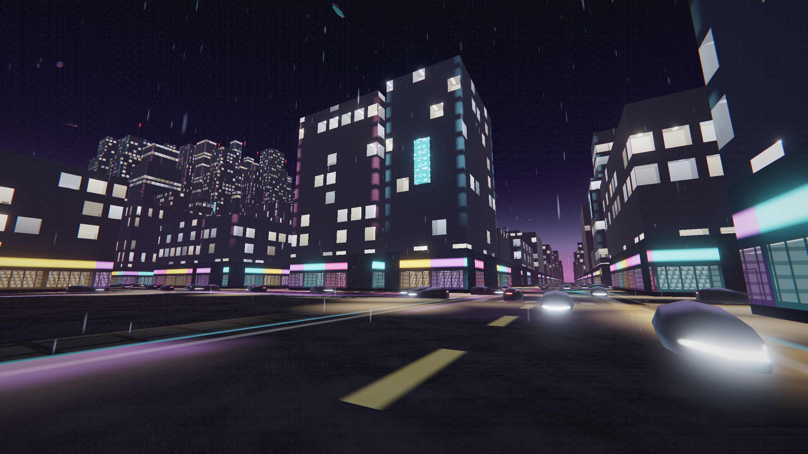

# Cyber City
Cyber City is a 50 KB Demoscene Explorer Game

A procedurally generated neon city you can walk around in, as a single native Windows executable.

No textures. No meshes. No audio files. Every pixel is done with math. The entire world is a pure function of the integer coordinates of a city block, which is why an infinite city fits in a file smaller than a low-res JPEG.

Requirements to run
64-bit Windows and an OpenGL 3.3 driver

## Controls

| Key | Action |
|---|---|
| W A S D | Walk |
| Mouse | Look |
| Shift | Run |
| Space | Jump |
| F | Toggle fly mode |
| Space / Ctrl | Ascend / descend (fly mode) |
| F12 | Save a screenshot as cybercity.tga |
| Esc | Quit |

## How it stays small
With no assets, file size is code size, so every design decision is really about making a few instructions to express something.

No C runtime. /NODEFAULTLIB with a bare entry() point. 

memset and memcpy are four lines each; 

sin/cos are a polynomial in mathlib.h;

sqrt is a single SSE instruction. 

This alone saves ~50 KB over a stock CRT build, and removes every runtime dependency — the executable imports nothing but kernel32, user32, gdi32 and opengl32.

Nothing is stored, only computed. There is no city in memory. Block layout, building heights, window lighting, signage and traffic are all pure functions of a cell coordinate, so the city is infinite, identical on every run, and occupies zero bytes on disk. Large arrays are uninitialised globals, which live in .bss and cost nothing in the file.

Geometry is derived, not stored. Every shape comes out of gl_VertexID in the vertex shader: buildings and signs from a unit cube, vehicles from a lofted hull (rings of superelliptical cross-sections; the roof is the minimum of two straight lines, a long rake from the canopy down to a very low nose and a short fastback to the tail, which is what makes it read as a wedge rather than a bubble), rain from a camera-facing quad. There is no vertex buffer for geometry at all — the only VBO holds per-instance data, which is laid out as four contiguous ranges (boxes, vehicles, rain, text) drawn with four instanced calls.

There is no title-screen renderer. The title and controls screens are the live city gameplay with a scripted dolly camera, the scene dimmed by a uniform, and letterbox bars in the composite. The text is a 5x7 bitmap font pushed through the same instance stream as everything else, one screen-space quad per lit font pixel, written into the HDR target before the bloom pass - so the existing bloom chain does the neon glow for free. The whole front end costs one extra draw call and no new shader.

Detail comes from the fragment shader. A building is a box. Its windows, mullions, shopfronts and signage are computed from a hash of the world position. A single four-line window function produces a thousand individually lit windows per tower.

Windows have interiors, without geometry. Behind each lit pane the fragment shader intersects the view ray with a box and shades whichever inner face it hits — back wall, side wall, floor, or a ceiling with a luminaire in it. This is interior mapping (van Dongen, 2008), the technique GTA V and Spider-Man use. The parallax is free, because the ray depends on the view direction: rooms shift correctly as you walk past, and looking up at a window from the street shows its ceiling. Some rooms have blinds part-drawn, and some have furniture silhouetted against the back wall. One ray-box intersection per lit window pixel, no meshes and no textures. It is skipped once a window falls under a pixel, where the parallax would only alias.

Shops have interiors too. The same ray-box trace serves both, with the box size passed in: a 3.6 m office window or a 6 m retail unit. Shops get shelving on the back wall with stock blocked out along each shelf, rows of ceiling panels running back into the space, and darker side walls so the box reads as depth. Sharing one room_trace between them was cheaper than writing the intersection twice.

Colour is placed, not sprinkled. Lit windows are white light with a color temperature - cool fluorescent, neutral, warm incandescent, and a rare green cast from old tubes - with downtown skewing warmer via a district value carried in the otherwise unused per-instance direction slot. Saturated colour is reserved for where it means something: shopfront glazing, fascia neon, signage, and segmented accent lighting on building corners. Scattering teal and magenta through the window grid made the towers read as decoration rather than as buildings.

Lighting is emissive-only. There is no lighting model, no shadow maps, no light rig — a night city is dark surfaces plus emissive sources plus fog plus bloom. Deleting the lighting system was both the largest code saving and the correct look.

Collision is closed-form. Because the layout is a grid, "am I inside a building?" is a modulo and two comparisons. No physics engine, no broadphase, no stored colliders.

Traffic is stateless. Cars are never spawned, stored, or simulated. Car k in a lane is at time * speed + k * spacing, forever; each frame draws whichever k fall inside the view. Traffic is therefore seamless and infinite for about forty lines of code.

Rain is stateless too. Drops are not particles with lifetimes. Each column of a grid around the camera holds a few drops whose position is a function of time, and every property — speed, length, width, brightness, phase — is hashed per drop. Sharing any of those across a column is what makes rain read as a conveyor belt rather than weather.

Where the bytes actually go

Code (.text)	~24,000

GLSL source strings	19,808 (43,422 before minifying)

Imports, headers, padding	~7,000

Total	51,712
